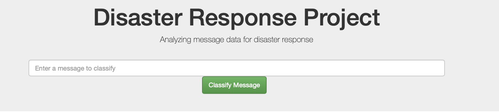
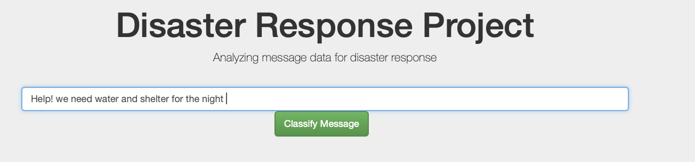
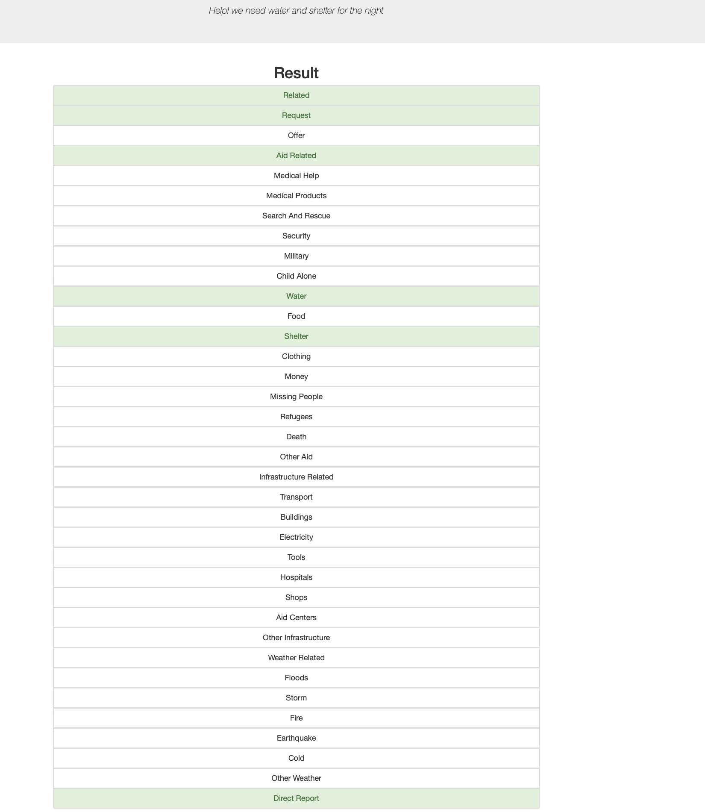
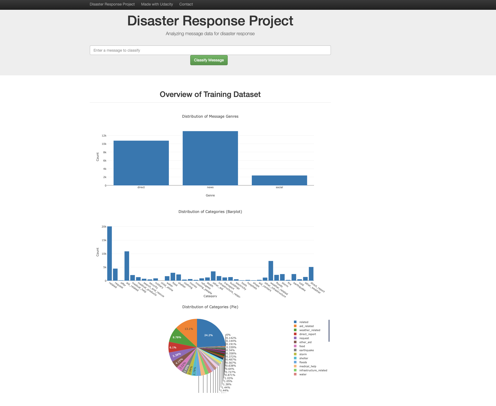

# Disaster Response Pipeline Project



## Table of Contents
1. [Description](#description)
2. [Getting Started](#getting_started)
	1. [Dependencies](#dependencies)
	2. [Installing](#installing)
	3. [Execution](#execution)
3. [Authors](#authors)
4. [Acknowledgement](#acknowledgement)
6. [Images](#images)

<a name="descripton"></a>
## Description

This Project is a part of Data Science Nanodegree Program by Udacity in collaboration with Figure Eight.
The initial data set contains real pre-labelled tweet and messages that were sent during disaster events. 
we aim to build a machine learning Natural Language Processing tool to categorize these events so that you 
can send the messages to an appropriate disaster relief agency.


The Project is divided in the following Sections:

1. Data Processin: An ETL Pipeline to extract data from source (.csv files with messages and categories), clean and preprocess the data
   and save them in a proper SQL database structure.
2. Machine Learning Pipeline: An ML pipeline to train a model capable of classifing text messages into categories.
3. Web App: A web app where an emergency worker could submit a new message and get classification results in several categories. 
   The web app also displays cool visualizations of the data. and represents the model results in real time. 

<a name="getting_started"></a>
## Getting Started

<a name="dependencies"></a>
### Dependencies
* Python 3.5+ (I used Python 3.7)
* All the libraries in the requirements.txt file. 

<a name="installing"></a>
### Installing
Clone the GIT repository using the following command:
```
git clone https://github.com/Spyroula/DisasterResponse_pipeline.git
```

Go to the project's root directory. 

Create a virtual environment using the following command:
```
python3 -m venv project-env
``` 

Activate the virtual environment using the following command:
```
python3 project-env/bin/activate
``` 

Install the required libraries using the following command:
```
python -m pip install -r requirements.txt
```


<a name="execution"></a>
### Execution:
1. Run the following commands in the project's root directory to set up your database and model.

    - To run ETL pipeline that cleans data and stores in database
        ```
        python data/process_data.py data/disaster_messages.csv data/disaster_categories.csv data/DisasterResponse.db
        ```
    - To run ML pipeline that trains classifier and saves
        ```
        python models/train_classifier.py data/DisasterResponse.db models/classifier.pkl
        ```

2. Run the following command in the app's directory to run your web app.
    ```
    python run.py
    ```

3. Go to http://0.0.0.0:3001/


<a name="authors"></a>
## Authors

* [Spyroula Masiala](https://github.com/Spyroula)


<a name="acknowledgement"></a>
## Acknowledgements

* [Udacity](https://www.udacity.com/) for providing the Data Science Nanodegree Program
* [Figure Eight](https://www.figure-eight.com/) for providing the pre-labeled dataset to train my model

<a name="images"></a>
## Images

1. This is an message example that a user can submit to test the performance of the trained Machine Learning model 



2. After clicking **Classify Message**, you can see the predicted categories which the message belongs to highlighted in green



3. The main page  of the app shows some cool visualisations and graphs about the training dataset, provided by Figure Eight


